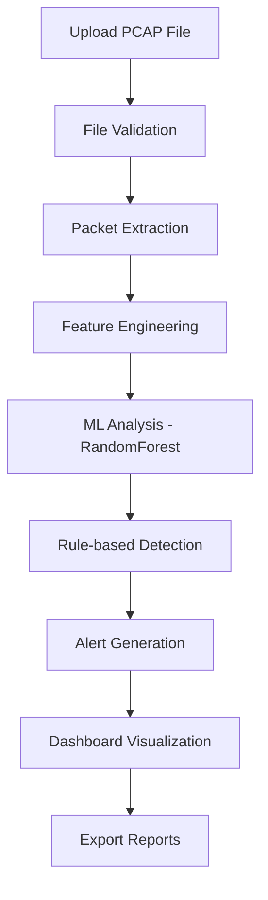
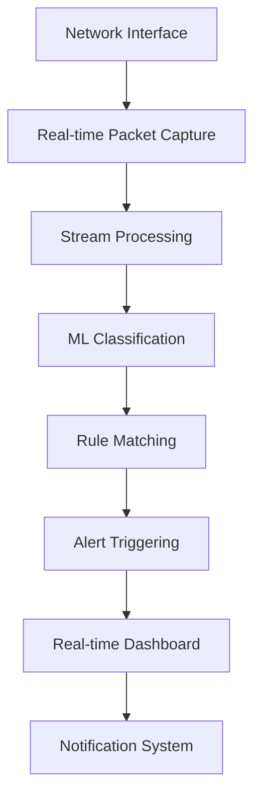

# NIDS Network Attack Detector

## 📋 Deskripsi Proyek

NIDS (Network Intrusion Detection System) Network Attack Detector adalah sistem deteksi intrusi jaringan yang menggunakan machine learning untuk menganalisis traffic jaringan dan mendeteksi serangan keamanan. Sistem ini mendukung dua mode operasi: analisis file PCAP dan monitoring real-time.

## 🏗️ Struktur Proyek

```
nids_network_attack_detector/
├── .env                    # Environment variables dan konfigurasi sensitif
├── .venv/                  # Virtual environment Python
├── README.md              # Dokumentasi proyek (file ini)
├── app.py                 # Aplikasi Flask utama - web server dan routing
├── config.py              # Konfigurasi aplikasi dan parameter sistem
├── login_live_monitoring.py # Modul autentikasi untuk live monitoring
├── real_time_alerts.py    # Handler untuk alert real-time dan notifikasi
├── requirements.txt       # Dependencies Python yang diperlukan
│
├── main/                  # Core analysis modules
│   ├── analyst.py         # Machine learning engine dengan RandomForest
│   ├── rules.py           # Rule-based detection engine
│   ├── logs/              # Log files sistem
│   └── reports/           # Generated analysis reports
│
├── static/                # Frontend assets
│   ├── css/
│   │   ├── app.css        # Styling untuk aplikasi
│   │   └── style.css      # Additional styles
│   └── js/
│       ├── app.js         # JavaScript logic utama
│       └── script.js      # Additional scripts
│
├── templates/             # HTML templates (Jinja2)
│   ├── dashboard.html     # Dashboard utama dengan visualisasi
│   ├── guide.html         # Panduan penggunaan sistem
│   └── index.html         # Landing page dan upload interface
│
├── uploads/               # Directory untuk file PCAP yang diupload
│   └── *.pcap/*.pcapng    # File PCAP untuk analisis
│
└── venv/                  # Alternative virtual environment
```

## 🔄 Alur Kerja Sistem

### 1. Mode Analisis File PCAP



**Langkah-langkah:**

1. **Upload**: User mengupload file PCAP melalui `index.html`
2. **Processing**: `app.py` menerima file dan menyimpan ke `/uploads`
3. **Analysis**: `analyst.py` mengekstrak fitur dan menjalankan ML model
4. **Detection**: `rules.py` menerapkan rule-based detection
5. **Visualization**: Results ditampilkan di `dashboard.html`
6. **Reporting**: Generate PDF reports melalui JavaScript

### 2. Mode Live Monitoring



**Langkah-langkah:**

1. **Authentication**: Login melalui `login_live_monitoring.py`
2. **Capture**: Real-time packet capture dari network interface
3. **Processing**: Stream processing dengan `analyst.py`
4. **Detection**: Real-time rule matching dengan `rules.py`
5. **Alerting**: `real_time_alerts.py` mengirim notifikasi
6. **Monitoring**: Live dashboard updates

## 📁 Penjelasan File Utama

### Core Application Files

| File               | Fungsi                                               | Teknologi       |
| ------------------ | ---------------------------------------------------- | --------------- |
| `app.py`           | Web server utama, routing, file upload handling      | Flask, Werkzeug |
| `config.py`        | Konfigurasi database, ML parameters, system settings | Python Config   |
| `requirements.txt` | Dependencies: Flask, scikit-learn, scapy, pandas     | pip             |

### Analysis Engine

| File              | Fungsi                                                | Teknologi            |
| ----------------- | ----------------------------------------------------- | -------------------- |
| `main/analyst.py` | Machine learning engine dengan RandomForestClassifier | scikit-learn, pandas |
| `main/rules.py`   | Rule-based detection engine, signature matching       | Python, regex        |
| `main/logs/`      | System logs, analysis logs, error tracking            | Logging              |
| `main/reports/`   | Generated PDF reports, analysis summaries             | jsPDF                |

### Frontend Components

| File                       | Fungsi                                   | Teknologi            |
| -------------------------- | ---------------------------------------- | -------------------- |
| `templates/index.html`     | Landing page, file upload interface      | HTML5, Bootstrap     |
| `templates/dashboard.html` | Main dashboard, charts, analysis results | Chart.js, Bootstrap  |
| `templates/guide.html`     | User guide, documentation                | HTML5                |
| `static/css/app.css`       | Main styling, responsive design          | CSS3, Bootstrap      |
| `static/js/app.js`         | Dashboard logic, chart rendering         | JavaScript, Chart.js |

### Monitoring & Security

| File                       | Fungsi                                | Teknologi       |
| -------------------------- | ------------------------------------- | --------------- |
| `login_live_monitoring.py` | Authentication untuk live monitoring  | Flask-Login     |
| `real_time_alerts.py`      | Real-time alert system, notifications | WebSocket, SMTP |

## 🚀 Setup dan Instalasi

### 1. Prerequisites

```bash
# Python 3.8+ required
python --version

# Git untuk cloning
git --version
```

### 2. Clone Repository

```bash
git clone <repository-url>
cd nids_network_attack_detector
```

### 3. Virtual Environment Setup

```bash
# Buat virtual environment
python -m venv .venv

# Aktivasi virtual environment
# Windows:
.venv\Scripts\activate

# Linux/Mac:
source .venv/bin/activate
```

### 4. Install Dependencies

```bash
# Install semua dependencies
pip install -r requirements.txt

# Dependencies utama:
# - Flask (web framework)
# - scikit-learn (machine learning)
# - scapy (packet analysis)
# - pandas (data processing)
# - numpy (numerical computing)
```

### 5. Environment Configuration

```bash
# Buat file .env
cp .env.example .env

# Edit konfigurasi
# .env file:
FLASK_ENV=development
SECRET_KEY=your-secret-key
UPLOAD_FOLDER=uploads
MAX_CONTENT_LENGTH=100MB
ML_MODEL_PATH=models/
LOG_LEVEL=INFO
```

### 6. Directory Setup

```bash
# Buat directory yang diperlukan
mkdir -p main/logs
mkdir -p main/reports
mkdir -p uploads
mkdir -p models

# Set permissions (Linux/Mac)
chmod 755 uploads
chmod 755 main/logs
chmod 755 main/reports
```

### 7. Database Setup (jika diperlukan)

```bash
# Initialize database
python -c "from app import init_db; init_db()"
```

## 🏃‍♂️ Menjalankan Aplikasi

### Mode Development

```bash
# Jalankan Flask development server
python app.py

# Atau dengan Flask CLI
export FLASK_APP=app.py
export FLASK_ENV=development
flask run

# Akses aplikasi di: http://localhost:5000
```

### Mode Production

```bash
# Menggunakan Gunicorn
pip install gunicorn
gunicorn -w 4 -b 0.0.0.0:5000 app:app

# Atau dengan uWSGI
pip install uwsgi
uwsgi --http :5000 --wsgi-file app.py --callable app
```

## 📊 Penggunaan Sistem

### 1. Analisis File PCAP

1. **Upload File**:

   - Buka `http://localhost:5000`
   - Pilih file PCAP (.pcap/.pcapng)
   - Klik "Analyze"

2. **View Results**:

   - Dashboard menampilkan hasil analisis
   - Charts menunjukkan distribusi serangan
   - Table menampilkan detail alerts

3. **Export Reports**:
   - Executive Summary (PDF)
   - Detailed Report (PDF)

### 2. Live Monitoring

1. **Login**:

   - Akses `/live-monitoring`
   - Login dengan credentials

2. **Start Monitoring**:

   - Pilih network interface
   - Set detection parameters
   - Start real-time capture

3. **Monitor Alerts**:
   - Real-time dashboard updates
   - Alert notifications
   - Live statistics

## 🔧 Konfigurasi Advanced

### Machine Learning Model

```python
# config.py
ML_CONFIG = {
    'model_type': 'RandomForest',
    'n_estimators': 100,
    'max_depth': 10,
    'random_state': 42,
    'feature_selection': True,
    'cross_validation': True
}
```

### Detection Rules

```python
# rules.py configuration
RULE_CONFIG = {
    'enable_signature_detection': True,
    'enable_anomaly_detection': True,
    'threshold_sensitivity': 'medium',
    'custom_rules_path': 'rules/custom.rules'
}
```

### Network Interface

```python
# Live monitoring configuration
NETWORK_CONFIG = {
    'interface': 'eth0',  # atau 'auto' untuk auto-detect
    'promiscuous_mode': True,
    'buffer_size': 65536,
    'timeout': 1000
}
```

## 🐛 Troubleshooting

### Common Issues

1. **Permission Denied saat Packet Capture**:

   ```bash
   # Linux: Jalankan dengan sudo atau set capabilities
   sudo setcap cap_net_raw+ep /usr/bin/python3
   ```

2. **Module Import Error**:

   ```bash
   # Pastikan virtual environment aktif
   pip install -r requirements.txt
   ```

3. **File Upload Error**:
   ```bash
   # Check upload directory permissions
   chmod 755 uploads/
   ```

### Logs Location

- Application logs: `main/logs/app.log`
- Analysis logs: `main/logs/analysis.log`
- Error logs: `main/logs/error.log`

## 📈 Performance Optimization

### Untuk File PCAP Besar

```python
# config.py
PERFORMANCE_CONFIG = {
    'chunk_size': 10000,  # Process packets in chunks
    'parallel_processing': True,
    'memory_limit': '2GB',
    'cache_results': True
}
```

### Untuk Live Monitoring

```python
# real_time_alerts.py
REALTIME_CONFIG = {
    'buffer_size': 1000,
    'batch_processing': True,
    'alert_throttling': True,
    'max_alerts_per_minute': 100
}
```

## 🔒 Security Considerations

1. **File Upload Security**:

   - Validasi file type dan size
   - Scan untuk malware
   - Isolasi upload directory

2. **Network Monitoring**:

   - Encrypted communication
   - Access control
   - Audit logging

3. **Data Privacy**:
   - Anonymize sensitive data
   - Secure storage
   - Data retention policies

## 📚 Dependencies Detail

```txt
# Core Framework
Flask==2.3.3
Werkzeug==2.3.7

# Machine Learning
scikit-learn==1.3.0
pandas==2.0.3
numpy==1.24.3

# Network Analysis
scapy==2.5.0
networkx==3.1

# Data Processing
sqlalchemy==2.0.20
psycopg2-binary==2.9.7

# Utilities
requests==2.31.0
python-dotenv==1.0.0
```

## 🤝 Contributing

1. Fork repository
2. Create feature branch
3. Commit changes
4. Push to branch
5. Create Pull Request

## 📄 License

MIT License - see LICENSE file for details.

---

**Developed by Desta Fauzi H**
**Version 1.0.0**
